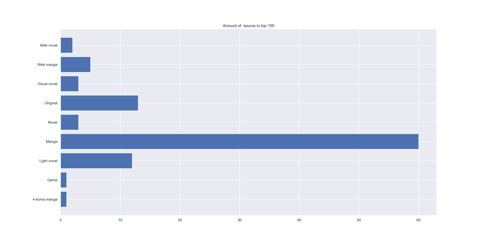

# Table of Contents
- [Table of Contents](#table-of-contents)
- [MyAnimeList Data Analysis](#myanimelist-data-analysis)
- - [Project Goal](#project-goal)
- - [Note](#note)
- - [Technologies & Tools](#technologies-and-tools)
- [1. Brief MAL Data Analysis Over Time](#1-brief-mal-data-analysis-over-time)
- - [Remarks](#remarks)
- - [Data Interpretation](#data-interpretation)
- - [Predictions](#predictions)
- - [Conclusion](#conclusion)
- [2. Brief Analysis of Genre and Themes as well as Studios of the MAL Dataset](#2-brief-analysis-of-genre-and-themes-as-well-as-studios-of-the-mal-dataset)
- - [Remarks](#remarks)
- - [Data Interpretation](#data-interpretation)
- - [Conclusion](#conclusion)
- [3. Brief Score-Oriented Analysis of the MAL Dataset](#3-brief-score-oriented-analysis-of-the-mal-dataset)
- - [Remarks](#remarks)
- - [Data Interpretation](#data-interpretation)
- - [Conclusion](#conclusion)
- [Learnings](#learnings)

# MyAnimeList Data Analysis

This project explores data from [MyAnimeList (MAL)](https://myanimelist.net/) using the [Jikan API](https://jikan.moe/#). MAL is a social cataloging platform for anime and manga fans, offering a wide range of metadata and user-generated content.

## Project Goal
This repository serves as a **learning-by-doing** project focused on:

- Fetching anime/manga data using the Jikan API
- Cleaning and transforming raw data
- Exploring relationships between different features
- Applying clustering techniques
- Performing predictive analysis

##  Note
This is a **learning project**, not intended for production or perfection. The goal is to practice real-world data workflows and apply analytical thinking in a practical context.

##  Technologies and Tools
- **Python** (pandas, sklearn, matplotlib, etc.)
- **Jikan API** for MAL data

# 1. Brief MAL Data Analysis Over Time

**(April 2025)**

Below you'll find a **very brief** analysis of some trends in the MAL dataset. 

**Note**:  
- This analysis intentionally omits some relationships and detailed interpretations. 
- With more time and demand, much deeper insights can be extracted.
- It is meant primarily as a *learning exercise* and not a comprehensive study.
---

## Remarks
- **Engagement by year** refers to engagement **with shows from that year**, not interactions that happened **during** that year.
- The low number of shows in the early years makes it harder to draw solid conclusions.
- For entries before 2004, engagement occurred post-release, since MAL launched in November 2004.

---

## Data Interpretation

### Entry Growth Over Time

It’s no surprise that the number of entries has grown over time, especially in the last decade.

A clear dip appears around 2020 due to COVID-19.  
- **Movies and specials** decreased.  
- **Music-related content** increased noticeably.

---

### TV, OVA, ONA Trends

- ONAs have exploded in recent years.  
  Titles like *Cyberpunk: Edgerunners* and *Shiguang Dailiren* are standout examples.

---

### Movie & Special Output

A more focused look shows the decline in movie and special releases over time.

---

### Source Material Usage

- Original works had a notable rise (and possibly a recent fall).
- Manga remains a strong, consistent source.
- Web manga and light novels are rising.
- Visual novels and traditional novels are declining.

Also visualized here:  

---

### Performance & Score Trends

Just the number of shows doesn't tell the full story. Performance matters too.

- Original works tend to score higher in the last decade.

But scores in general have been rising:

- The average score rose by ~0.5 points over the past 5 years.
- A 6.5 today might’ve been a 6.0 thirty years ago, but we can’t confirm without knowing when scores were given.
- Still, the score increase appears consistent, not skewed by outliers.

---

### Engagement Trends

- Fewer people are scoring shows since 2015.
- Fewer than half of all shows are scored by more than 5,000 users.

Other engagement metrics follow similar trends:

- Most shows have low engagement.  
- A small number of hits drive the stats up.
- Average engagement per show has dropped since 2015, even though the total number of shows is about the same.

We can’t say overall MAL activity is lower, just that newer shows get less engagement on average.

---

### Other Notable Trends

#### Duration

- **Movies** are longer than they used to be.
- **TV specials** are now half as long as pre-2000.
- **TV shows** stayed fairly consistent.

#### Episodes

- Show lengths (episode count) are down, likely due to seasonal splits.
  - e.g. *The Apothecary Diaries* S1 & S2 = ~50 episodes total, but recorded as two ~25-episode series.
- Some movies are split into multiple parts but counted under one entry.
- OVAs and ONAs resemble TV shows more than ever.

Also illustrated in:  

---

### Rating Distributions

- Most content now targets teens or older:
  - 50%+ rated **PG-13**
- A lange amount targets everyone:
  - ~22% have no restriction
- **R+/Rx (NSFW)** is rarer in proportion, but still increased in raw numbers.

See also:  

- 60%+ of R+/Rx content was released in the last 25 years, but total releases have also skyrocketed.

---

### Episode Lengths

- Most entries today are either:
  - Under 5 minutes, or  
  - 20–30 minutes long.
- Short-format anime is significantly more common now.

---

## Predictions

I originally wanted to predict scores, but started by analyzing trends over time.

Here’s a **prediction of seasonal averages for 2025**, based on seasonal and yearly groupings.

Grouping by **year and season** instead of just year allowed more granular predictions (e.g. Winter 2025, Spring 2025, etc.).

**Postponed**
- I tried using ARIMA from sklearn
- only got negative r2 values
  - even using a parameter search
- not sure where I went wrong
- needs more investigating, will skip this for now

---

## Conclusion
The MAL dataset provides a depp insight in the development and propularity of anime over the last 25 years and gives a good idea of teh development of the last 55 years.

---

# 2. Brief Analysis of Genre and Themes as well as Studios of the MAL Dataset

**(May 2025)**

Below you'll find a very brief analysis of the MAL dataset with a focus on genre and themes.
Studios will also be considered, but are not the main priority.

**Note**:  
- This analysis intentionally omits some relationships and detailed interpretations. 
- With more time and demand, much deeper insights can be extracted.
- It is meant primarily as a *learning exercise* and not a comprehensive study.

---

## Remarks

- **Only non-zero score entries** are considered to ensure that the analysis focuses on relevant, aired content.
- **Only completed entries** are included to avoid misleading or incomplete data, such as shows with zero episodes.
- **Solo vs. combination categorization** is applied:
  - Genres and themes often appear in combinations (e.g., *Action, Adventure, Fantasy*).
  - Studios may appear either solo or in combination with others.

---

## Data Interpretation

### Distribution Overview

#### Genre Usage

- Most frequently used genres:
  - **Comedy**, **Action**, and **Fantasy** — each appears in over 3,000 entries.
- Least frequently used genres:
  - **Erotica**, **Girls Love**, and **Gourmet** — each appears in fewer than 250 entries.

#### Theme Usage

- **Music** is the most used theme, significantly ahead of **School** (by roughly 50%).
- **Villainess** is the least used theme.
- Themes are used less frequently than genres:
  - ~2,300 entries have no genre.
  - ~6,200 entries have no theme.
  - Average: **1.77 genres** per entry, but only **0.99 themes**.

---

### Average Scoring

#### Genre Scores

- Top scoring genres include **Award Winning**, **Suspense**, **Mystery**, **Drama**, and **Romance**.
  - *Suspense* and *Mystery* have fewer entries but strong average scores.
  - *Drama* and *Romance* are widely represented (~2,000 entries each).
- Lowest scoring genre: **Avant Garde** — average score below 5.5 with ~500 entries.

#### Theme Scores

- Average theme scores range between 6.1 and 7.5.
- Highest scoring themes (with low occurrence):
  - **Love Polygon**: 103 entries
  - **Love Status Quo**: 39 entries
  - **Childcare**: 61 entries
  - **Iyashikei**: 167 entries
- More representative themes by sample size:

| Theme      | Avg. Score | Entries |
|------------|------------|---------|
| Military   | 6.89       | 615     |
| Historical | 6.80       | 1019    |
| Mecha      | 6.51       | 1059    |
| School     | 6.85       | 1903    |

#### Genre-Theme Score Combinations

- Best scoring combo (≥30 entries): **Adventure + Comedy + Mystery x Detective** — average score peaks at 7.6.
- Well-used genres like **Comedy**, **Action**, and **Fantasy** generally perform well with themes.
- Worst combo (≥30 entries): **Avant Garde x Music**.

---

### Source Analysis

#### Genre by Source

- Common sources include **Manga** and **Original Works**.
- **Games** and **Light Novels** are significant for genres like *Action*, *Adventure*, *Comedy*, and *Fantasy*.
- **Visual Novels** are dominant sources for NSFW genres like *Hentai*.

#### Theme by Source

- No notable outliers, but the data aligns with expected trends regarding source-theme pairings.

---

### Duration Trends

#### Genre by Duration

- Most entries cluster around the 24-minute mark.
- **Action**, **Adventure**, and **Fantasy** also appear across a wide duration range.
- **Slice of Life** and **Avant Garde** are frequent in short formats (<5 minutes).
- **Comedy** spans all durations; short-form content (<5 minutes) makes up over 20%.
- **Drama** and **Sci-Fi** often feature in longer formats.

#### Theme by Duration

- No strong duration trends except for **Music**-tagged themes tending toward shorter formats.

---

### Genre x Theme Matching (Solo Mode)

- **Action** is associated with nearly every theme.
- **Avant Garde** mainly pairs with **Music**.
- Themes like **School** are commonly combined with *Romance*, *Sport*, *Drama*, and *Comedy*.
- **Isekai** settings tend to pair with *Action*, *Adventure*, *Comedy*, and *Fantasy*.
- **CGDCT** (Cute Girls Doing Cute Things) appears with *Comedy* and *Slice of Life*.
- **Parody** is mainly paired with *Comedy*.

---

### Tables

#### Most single used genre, theme, studio per year

| Year | Max Genre | Genre Count | Max Studio       | Studio Count | Max Theme  | Theme Count |
|------|-----------|-------------|------------------|---------------|------------|--------------|
| 1970 | Sports    | 12          | Toei Animation   | 5             | Music      | 8            |
| 1971 | Comedy    | 7           | Toei Animation   | 6             | Music      | 10           |
| 1972 | Adventure | 8           | Toei Animation   | 5             | Music      | 6            |
| 1973 | Adventure | 10          | Toei Animation   | 8             | Music      | 7            |
| 1974 | Adventure | 10          | Toei Animation   | 6             | Music      | 7            |
| 1975 | Adventure | 12          | Toei Animation   | 9             | Mecha      | 9            |
| 1976 | Action    | 13          | Toei Animation   | 8             | Mecha      | 11           |
| 1977 | Drama     | 11          | Toei Animation   | 9             | Mecha      | 10           |
| 1978 | Adventure | 20          | Toei Animation   | 13            | Music      | 10           |
| 1979 | Adventure | 25          | Toei Animation   | 12            | Historical | 14           |
| 1980 | Adventure | 24          | Toei Animation   | 19            | Space      | 14           |
| 1981 | Sci-Fi    | 28          | Toei Animation   | 20            | Historical | 14           |
| 1982 | Sci-Fi    | 31          | Toei Animation   | 18            | Mecha      | 16           |
| 1983 | Action    | 29          | Toei Animation   | 13            | Mecha      | 19           |
| 1984 | Sci-Fi    | 30          | Toei Animation   | 11            | Mecha      | 16           |
| 1985 | Sci-Fi    | 37          | Pierrot          | 12            | Mecha      | 18           |
| 1986 | Action    | 45          | Toei Animation   | 18            | Mecha      | 17           |
| 1987 | Sci-Fi    | 46          | Toei Animation   | 13            | Mecha      | 22           |
| 1988 | Comedy    | 49          | Toei Animation   | 18            | Mecha      | 21           |
| 1989 | Action    | 52          | Sunrise          | 15            | Mecha      | 18           |
| 1990 | Comedy    | 60          | Toei Animation   | 17            | Mecha      | 16           |
| 1991 | Comedy    | 53          | Pierrot          | 12            | Mecha      | 16           |
| 1992 | Comedy    | 53          | Toei Animation   | 17            | Mecha      | 16           |
| 1993 | Fantasy   | 50          | Toei Animation   | 19            | Historical | 14           |
| 1994 | Comedy    | 59          | Toei Animation   | 17            | Mecha      | 17           |
| 1995 | Comedy    | 65          | Toei Animation   | 13            | Mecha      | 19           |
| 1996 | Comedy    | 64          | Toei Animation   | 13            | Mecha      | 23           |
| 1997 | Comedy    | 69          | Toei Animation   | 13            | Mecha      | 18           |
| 1998 | Comedy    | 72          | Sunrise          | 15            | Mecha      | 27           |
| 1999 | Comedy    | 99          | Toei Animation   | 13            | Mecha      | 30           |
| 2000 | Comedy    | 71          | Toei Animation   | 13            | Mecha      | 20           |
| 2001 | Comedy    | 93          | Nippon Animation | 15            | Mecha      | 24           |
| 2002 | Comedy    | 110         | Madhouse         | 20            | Mecha      | 32           |
| 2003 | Comedy    | 110         | Madhouse         | 18            | Mecha      | 26           |
| 2004 | Comedy    | 132         | Toei Animation   | 15            | Mecha      | 38           |
| 2005 | Comedy    | 117         | Toei Animation   | 14            | Mecha      | 31           |
| 2006 | Comedy    | 159         | Toei Animation   | 28            | School     | 46           |
| 2007 | Comedy    | 134         | Madhouse         | 21            | School     | 64           |
| 2008 | Comedy    | 160         | Madhouse         | 18            | School     | 63           |
| 2009 | Comedy    | 177         | Sunrise          | 21            | Music      | 72           |
| 2010 | Comedy    | 179         | Sunrise          | 24            | Music      | 70           |
| 2011 | Comedy    | 207         | Production I.G   | 26            | Music      | 105          |
| 2012 | Comedy    | 227         | Sunrise          | 29            | Music      | 123          |
| 2013 | Comedy    | 238         | Sunrise          | 24            | Music      | 119          |
| 2014 | Comedy    | 270         | Sunrise          | 22            | Music      | 130          |
| 2015 | Comedy    | 237         | A-1 Pictures     | 26            | School     | 123          |
| 2016 | Comedy    | 249         | A-1 Pictures     | 26            | Music      | 149          |
| 2017 | Comedy    | 220         | A-1 Pictures     | 20            | Music      | 176          |
| 2018 | Comedy    | 211         | J.C.Staff        | 19            | Music      | 168          |
| 2019 | Comedy    | 201         | J.C.Staff        | 19            | Music      | 200          |
| 2020 | Comedy    | 172         | AQUA ARIS        | 16            | Music      | 214          |
| 2021 | Fantasy   | 198         | AQUA ARIS        | 16            | Music      | 248          |
| 2022 | Fantasy   | 216         | AQUA ARIS        | 22            | Music      | 234          |
| 2023 | Fantasy   | 249         | AQUA ARIS        | 25            | Music      | 181          |
| 2024 | Fantasy   | 194         | J.C.Staff        | 16            | Music      | 101          |

- A rise in **Fantasy** after a long era of **Comedy**.
- A long era of **Toei Animation** followed by **Madhouse**, **Sunrise**, **A-1 Pictures** and **AQUA ARIS**.
- Themes are mainly dominated by **Mecha** and **Music**.

#### Most used genre combination

|   year | genre.max                |   amount |
|-------:|:-------------------------|---------:|
|   1970 | Drama,Sports             |        6 |
|   1971 | Avant Garde              |        4 |
|   1972 | Adventure,Fantasy        |        3 |
|   1973 | Action,Adventure,Sci-Fi  |        3 |
|   1974 | Action,Adventure,Sci-Fi  |        3 |
|   1975 | Avant Garde              |        8 |
|   1976 | Action,Sci-Fi            |        7 |
|   1977 | Adventure,Drama          |        3 |
|   1978 | Action,Adventure,Sci-Fi  |        6 |
|   1979 | Drama                    |        7 |
|   1980 | Comedy                   |        4 |
|   1981 | Comedy,Sci-Fi            |        6 |
|   1982 | Action,Adventure,Sci-Fi  |        5 |
|   1983 | Action,Sci-Fi            |        7 |
|   1984 | Action,Adventure,Sci-Fi  |        6 |
|   1985 | Hentai                   |       13 |
|   1986 | Comedy                   |       11 |
|   1987 | Action,Sci-Fi            |       10 |
|   1988 | Comedy                   |       10 |
|   1989 | Comedy                   |       11 |
|   1990 | Adventure,Fantasy        |        9 |
|   1991 | Fantasy                  |        9 |
|   1992 | Fantasy                  |       12 |
|   1993 | Fantasy                  |       17 |
|   1994 | Sports                   |       10 |
|   1995 | Comedy                   |       11 |
|   1996 | Hentai                   |       17 |
|   1997 | Hentai                   |       12 |
|   1998 | Hentai                   |       16 |
|   1999 | Hentai                   |       22 |
|   2000 | Hentai                   |       30 |
|   2001 | Hentai                   |       69 |
|   2002 | Hentai                   |       60 |
|   2003 | Hentai                   |       52 |
|   2004 | Hentai                   |       46 |
|   2005 | Hentai                   |       40 |
|   2006 | Hentai                   |       34 |
|   2007 | Hentai                   |       40 |
|   2008 | Comedy                   |       47 |
|   2009 | Comedy                   |       61 |
|   2010 | Comedy                   |       53 |
|   2011 | Comedy                   |       69 |
|   2012 | Comedy                   |       75 |
|   2013 | Comedy                   |      102 |
|   2014 | Comedy                   |      103 |
|   2015 | Comedy                   |       82 |
|   2016 | Comedy                   |      101 |
|   2017 | Comedy                   |       95 |
|   2018 | Comedy                   |       77 |
|   2019 | Comedy                   |       65 |
|   2020 | Comedy                   |       57 |
|   2021 | Comedy                   |       76 |
|   2022 | Comedy                   |       58 |
|   2023 | Action,Adventure,Fantasy |       53 |
|   2024 | Action,Adventure,Fantasy |       61 |

- **1991 to 2022** are single entries,
- - probably due to a lot of combinations that are **too specific** .
- The last 2 years are again combinations: **Action**, **Adventure** and **Fantasy**.

#### Best performing genre, theme and studio with score and amount of entries

|   year | genre         |   score_x |   amount_x | theme             |   score_y |   amount_y | studio                     |   score |   amount |
|-------:|:--------------|----------:|-----------:|:------------------|----------:|-----------:|:---------------------------|--------:|---------:|
|   1970 | Drama         |   6.4875  |          8 | Combat Sports     |   6.69    |          4 | Mushi Production           | 6.885   |        2 |
|   1971 | Mystery       |   7.62    |          1 | Adult Cast        |   7.62    |          1 | Tokyo Movie Shinsha        | 7.62    |        1 |
|   1972 | Mystery       |   6.64    |          1 | Anthropomorphic   |   6.41    |          2 | Knack Productions          | 6.64    |        1 |
|   1973 | Drama         |   7.18667 |          3 | Martial Arts      |   6.63    |          1 | Nippon TV Douga            | 7.4     |        1 |
|   1974 | Drama         |   6.74    |          4 | Adult Cast        |   7.54    |          1 | Group TAC                  | 7.54    |        1 |
|   1975 | Suspense      |   7.21    |          1 | Pets              |   7.4     |          1 | Tokyo Movie Shinsha        | 7.21    |        1 |
|   1976 | Drama         |   6.766   |          5 | Anthropomorphic   |   6.78    |          1 | Madhouse                   | 6.99    |        1 |
|   1977 | Mystery       |   6.785   |          2 | Adult Cast        |   7.225   |          2 | Madhouse                   | 7.88    |        1 |
|   1978 | Drama         |   6.93789 |         19 | Military          |   7.245   |          2 | Group TAC                  | 7.245   |        2 |
|   1979 | Romance       |   6.96    |          4 | Crossdressing     |   8.34    |          1 | Telecom Animation Film     | 8.15    |        1 |
|   1980 | Sports        |   6.80571 |          7 | Combat Sports     |   7.71667 |          3 | Pierrot                    | 7.14    |        1 |
|   1981 | Romance       |   7.0925  |          4 | Otaku Culture     |   7.7     |          1 | Studio Deen                | 7.71    |        1 |
|   1982 | Boys Love     |   7.33    |          1 | Adult Cast        |   7.40333 |          3 | Pierrot                    | 7.18    |        2 |
|   1983 | Mystery       |   7.21    |          1 | Combat Sports     |   7.22    |          1 | Kaname Productions         | 7.37    |        1 |
|   1984 | Drama         |   6.89917 |         12 | Gore              |   7.96    |          1 | Topcraft                   | 7.325   |        2 |
|   1985 | Drama         |   6.71857 |         21 | Love Polygon      |   7.98    |          1 | Group TAC                  | 7.665   |        2 |
|   1986 | Slice of Life |   7.06    |          3 | Delinquents       |   7.56    |          1 | Studio Ghibli              | 8.26    |        1 |
|   1987 | Gourmet       |   7.11    |          1 | Adult Cast        |   7.49    |          3 | Gainax                     | 7.46    |        1 |
|   1988 | Gourmet       |   6.96    |          1 | Adult Cast        |   7.48167 |          6 | K-Factory                  | 9.01    |        1 |
|   1989 | Mystery       |   6.68    |          6 | Magical Sex Shift |   7.77    |          1 | Studio Ghibli              | 8.23    |        1 |
|   1990 | Adventure     |   6.40762 |         42 | Iyashikei         |   8.27    |          1 | Telescreen                 | 8.27    |        1 |
|   1991 | Girls Love    |   7.85    |          1 | Childcare         |   7.62    |          1 | Mushi Production           | 7.71    |        1 |
|   1992 | Boys Love     |   6.675   |          2 | Magical Sex Shift |   7.42    |          1 | Gallop                     | 7.45    |        1 |
|   1993 | Suspense      |   7.72    |          1 | Magical Sex Shift |   7.73    |          1 | Nippon Ramayana Film Co.   | 8.39    |        1 |
|   1994 | Sports        |   6.6875  |         12 | Magical Sex Shift |   7.57    |          1 | E&G Films                  | 7.89    |        1 |
|   1995 | Suspense      |   8.11667 |          3 | Psychological     |   8.11667 |          3 | Gainax                     | 8.36    |        1 |
|   1996 | Romance       |   7.0792  |         25 | Samurai           |   8.28    |          1 | Gallop                     | 8.03667 |        3 |
|   1997 | Gourmet       |   7.6     |          1 | Visual Arts       |   7.8     |          1 | Studio Ghibli              | 8.66    |        1 |
|   1998 | Suspense      |   7.74667 |          3 | Showbiz           |   7.49    |          2 | Gallop                     | 8.35    |        1 |
|   1999 | Mystery       |   7.20308 |         13 | Delinquents       |   8.68    |          1 | Pastel                     | 8.18    |        1 |
|   2000 | Gourmet       |   7.32    |          1 | Combat Sports     |   8.78    |          1 | J.C.Staff                  | 7.32    |        2 |
|   2001 | Sports        |   6.84083 |         12 | Samurai           |   7.96    |          1 | Bones                      | 7.82    |        2 |
|   2002 | Mystery       |   6.91619 |         21 | Showbiz           |   8.085   |          2 | Pastel                     | 7.59    |        1 |
|   2003 | Sports        |   7.071   |         10 | Childcare         |   8.28    |          1 | Telecom Animation Film     | 7.72    |        1 |
|   2004 | Gourmet       |   7.91    |          1 | Love Polygon      |   7.88    |          1 | Manglobe                   | 8.51    |        1 |
|   2005 | Suspense      |   7.425   |          6 | High Stakes Game  |   7.92    |          1 | Tokyo Movie Shinsha        | 8.03    |        1 |
|   2006 | Suspense      |   7.29818 |         11 | Organized Crime   |   8.10667 |          3 | Graphinica                 | 8.35    |        1 |
|   2007 | Suspense      |   7.78909 |         11 | High Stakes Game  |   8.26    |          1 | Khara                      | 8       |        1 |
|   2008 | Suspense      |   7.58071 |         14 | Showbiz           |   7.81333 |          3 | Kyoto Animation            | 8.21667 |        3 |
|   2009 | Suspense      |   7.53385 |         13 | Love Polygon      |   8.2     |          1 | Khara                      | 8.3     |        1 |
|   2010 | Mystery       |   7.1681  |         21 | Organized Crime   |   8.02    |          1 | White Fox                  | 8.3     |        1 |
|   2011 | Boys Love     |   7.4975  |          4 | Love Polygon      |   7.92    |          2 | White Fox                  | 9.07    |        1 |
|   2012 | Mystery       |   7.21188 |         32 | Gag Humor         |   7.74083 |         12 | White Fox                  | 7.7875  |        4 |
|   2013 | Suspense      |   7.20571 |         14 | Time Travel       |   8.9     |          1 | Studio Ghibli              | 8.165   |        2 |
|   2014 | Mystery       |   7.26656 |         32 | Childcare         |   8.1     |          2 | Artland                    | 8.59    |        4 |
|   2015 | Sports        |   7.39278 |         18 | High Stakes Game  |   8.14    |          1 | David Production           | 8.44    |        1 |
|   2016 | Mystery       |   7.09116 |         43 | Love Polygon      |   8.06667 |          3 | Egg Firm                   | 8.41    |        1 |
|   2017 | Boys Love     |   7.054   |          5 | Iyashikei         |   7.94625 |          8 | Orange                     | 8.39    |        1 |
|   2018 | Drama         |   6.9492  |        100 | Delinquents       |   8.46    |          1 | B.CMAY PICTURES            | 8.46    |        1 |
|   2019 | Suspense      |   7.15409 |         22 | Organized Crime   |   8.2     |          1 | B.CMAY PICTURES            | 8.46    |        1 |
|   2020 | Drama         |   7.03985 |         66 | Childcare         |   7.895   |          2 | Shirogumi                  | 8.19    |        1 |
|   2021 | Drama         |   7.16223 |        103 | Combat Sports     |   7.915   |          2 | B.CMAY PICTURES            | 8.68    |        1 |
|   2022 | Romance       |   7.21328 |         61 | Childcare         |   8.032   |          5 | DandeLion Animation Studio | 8.73    |        1 |
|   2023 | Drama         |   7.28027 |         73 | Showbiz           |   8.58    |          1 | LAN Studio                 | 8.64    |        1 |
|   2024 | Drama         |   7.44091 |         55 | Survival          |   8.84    |          1 | Studio DURIAN              | 8.65    |        1 |

- I am **unsure** about the impact of the studio part,
- - there is **often** **just 1 entry**.
- **Themes** are all over the place and are **not well tracked**.
- **Suspense** and **Drama** as genres doing very well in general.

## Conclusion
- **Genres** are **well tracked** and can give us a good idea of what to expect.
- They can provide an **indication of scoring**.
- **Themes** are **not well tracked**.
- There are **to many studios** for me to have an impactful conclusion.
- - **Toei Animation**, **Madhouse**, **A-1 Pictures** and **Shaft** **doing well**, but this is **no surprise**.
- **The whole consideration of genres, themes and studios could have been done better, there is a lot of room for improvement on my end, maybe I will visit this in the futur.**

# 3. Brief Score-Oriented Analysis of the MAL Dataset

**(May 2025)**

This is a brief, exploratory analysis of the **MyAnimeList (MAL)** dataset, with a specific focus on *score-related patterns*. 
While the dataset offers many possibilities for deeper insights, the goal here is not exhaustive analysis but rather to **gain familiarity with data tools** through a focused learning project.

---

## Remarks

- **Only non-zero score entries** are considered to ensure that the analysis focuses on relevant, aired content.
- **Only completed entries** are included to avoid misleading or incomplete data, such as shows with zero episodes.

---

## Data Interpretation

### Initial Observations

#### Score vs. Number of Users Who Scored

- Titles with **higher numbers of ratings** tend to have **scores above 7**.
- Entries with **fewer user ratings** are spread across the entire score range, indicating less consensus or lower visibility.

#### Score vs. Number of Users with the Entry on Their List

- A similar trend holds: **widely-listed entries tend to score higher**.
- Less-listed entries again show a broader spread of scores.

#### Score vs. Favorites

- The **most highly rated entries** are also **most frequently marked as favorites**.
- This is expected, as users are likely to favorite shows they rate highly.

#### Score vs. Duration

- Longer-duration shows tend to score higher overall.
- Manual clustering reveals:
  - Short-duration entries (likely Music) mostly score between **4–8**.
  - Typical TV-length shows (~23 mins) score between **5.5–9**.
  - Longer content (e.g., movies) tend to perform even better, possibly due to higher production quality or targeted marketing.

---

### Confirmation by considering Mean score

**Scored by**:

**On list**:

**Favorites**:

**Duration**:

- the average score tends to be quit high if the amount or duration is high
- - remember, I do not think that this is surprising
- - - good shows will be put on lists since people watched it, or want to watch it
- - - an entry that is favorite by a lot of persons is likely to be rated higher, why else should so many people favorite it
- - - good shows are watched by more people, and so they are scored by more people

### Exception: Episode Count

- High episode count **does not correlate** with higher scores.
- In fact, many top-scoring entries have **fewer than 13 episodes**, often standard cour lengths.
- - after shows with less than 4 episodes ~10485, shows around 10-13 episodes ~3158 make the majority of entries

- The **highest scoring entries** tend to have **relatively few episodes**.
- For context: the entry with the most episodes is *3000 Whys of Blue Cat* with **3057 episodes**.

### Top 100 Entries – Feature Breakdown

#### Type

- Nearly **70%** of top 100 entries are **TV shows**.
- Followed by **Movies** with around 20 entries.

#### Source

- **Manga** is the most common source, representing **60 entries**.
- **Original** and **Light Novel** sources follow with 10+ entries each.

#### Rating

- Over **50%** are rated **PG-13**, broadening their potential audience.
- **R-rated** entries account for ~40%.

#### Duration

- About **80%** of shows run **20–30 minutes** per episode.
- The remainder are mostly **feature-length** (90+ mins).

#### Episode Count

- Most top entries have **10–13 episodes**.
- Others include:
  - Entries with **<4 episodes**, only 3 of those are below 60 minutes.
  - Series with **25–60 episodes**, most commonly **20 or 26**.

#### Genre

- Leading genres include **Drama** and **Action**.
- Other common genres: **Adventure**, **Sci-Fi**, **Comedy**, **Supernatural**.

#### Theme

- **Historical** is the most frequent theme.
- Followed by **Military**, **School**, and **Gore**.

#### Studio

- Top studios: **Madhouse**, **MAPPA**, **Sunrise**, contributing over 20% combined.

#### Broadcast Day

- Excluding movies (with no fixed broadcast day), **Sunday** is the most common air day for top entries.

#### Airing Season

- **Fall** is the most represented season in the top 100.

#### Airing Year

- **40% of the top entries aired in the last 4 years**, showing a trend toward recent high-performing content.

---

### Score Trends Over Time (Last ~10 Years)

#### By Type

- General score increase across most types.
- **TV** and **TV Specials** slightly declined.
- **Movies** and **OVAs** show the most notable score gains.
- Followed by **ONA** and **Music**.

#### By Source

- **Music** adaptations surged in both volume and score.
- **Books**, **Visual Novels**, and **Originals** also improved.
- **Mixed Media**, **Picture Books**, and **Radio** saw score declines.

#### By Rating

- **Unrated**, **R-rated**, and **Rx-rated** shows all improved in average score,
- - where **Rx-rated** entries outperformed the rest.
- **PG-rated** shows experienced a slight decline.

#### By Episode Count

- There is a **significant score decrease** of shows with 
- - **more than 500** **episodes**,
- - - but we only have **1 entry**, so the impact of this data is **insignificant**.
- - **200-300** **episodes**, there are **7**.
- - **60-100** **episodes**, there are **24**.
- There is also in **increase** of entries with
- - **300-500 episodes**, there are **2** entries.
- - **200-100 episodes**, there are **16** entries.
- - **14-21 episodes**, there are **190** entries,
- - - this might be a **considerable amount**.
- - **less than 4 episodes**, there are **4080** entries,
- - - this is a **considerable** **amount**.

#### By Duration

- **Overall increase**, except
- - entries **longer than 160 minutes**, there are only **2** entries,
- - entries with a duration **between 120 and 150 minutes**, there are **32** entries.

---

## Conclusion

- Several features strongly correlate with higher scores: **favorites, list appearances, scoring count**.
- Score trends show a **general increase over the past decade**, especially for **Movies**, **OVAs**, and **Music** entries.
- Scoring behaviour over time has a **non-trivial impact** and should be considered.
- Feature-specific plots (e.g., score vs. episodes, duration) would benefit from **categorization/binning** to improve clarity and reduce visual noise.

---

# Learnings

**(May 2025)**

Let me present my, probably incomplete, list of learnings so far.

(Keep track on what you learned so you see your progress and can present them without looking at everything you did. The later case will take way more time...)

- General learnings:
- - Keep things short and clear.
- - Things take more time than you think they do.
- - - This is especially true if you are learning while doing.
- - It is okay to make mistakes.
- - - They are part of the process.
- - Managing a solo learning project takes effort and time.
- - Planing ahead can have an enormous impact on workflow.
- - Keeping track of todos and priories what to handle and if it should be handled at all (at the moment).
- Data collecting and cleaning related:
- - Collecting takes time.
- - Organizing is a huge part and needs to be taken in consideration.
- - - Tracking collected data, as well as warnings and errors.
- - Using an API and handling occurring problems.
- Data analysis related:
- - Ratios and totals are both important and should both considered before making assumptions.
- - A Plot can be overwhelming when it provides to much information.
- - Creating plots while analysing to avoid to many corrections later on. 
- Programming related:
- - Gathering data using request.
- - Using logging if things get overwhelming.
- - A feeling for pandas:
- - - What can I do, where to find help, how to identify helpful advice.
- - - Using pandas in general.
- - Using seaborn for heat plots.
- - Using matplotlib for plotting in general.
- - Efficiency is not the most important part if your data set is not overwhelmingly large.
- - - It is okay to do things why to complicate if you are learning.
- - Using markdowns for e.g. a Git README.
- - Using Git to back up und publish a project.
- - - Clear commit comments are quit useful.

