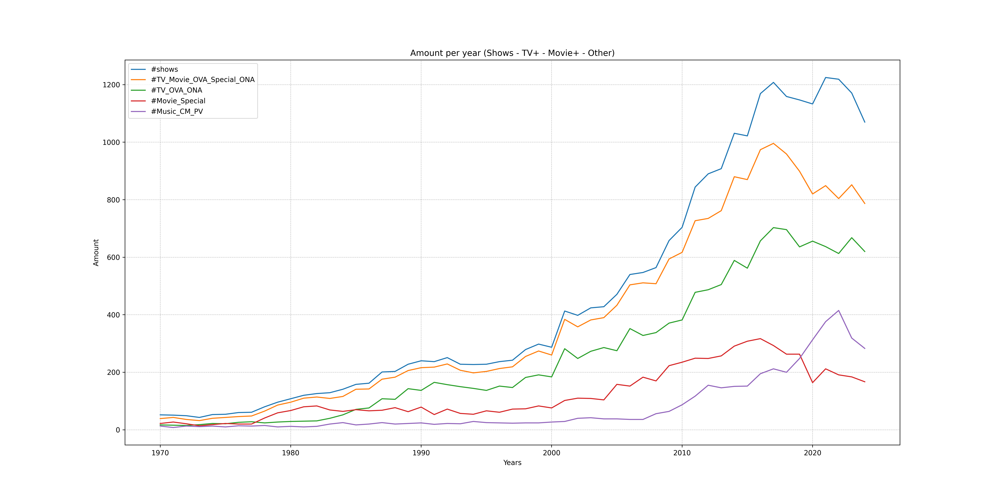

# MyAnimeList Data Analysis (via Jikan API)

This project explores data from [MyAnimeList (MAL)](https://myanimelist.net/) using the [Jikan API](https://jikan.moe/#). MAL is a social cataloging platform for anime and manga fans, offering a wide range of metadata and user-generated content.

## Project Goal
This repository serves as a **learning-by-doing** project focused on:

- Fetching anime/manga data using the Jikan API
- Cleaning and transforming raw data
- Exploring relationships between different features
- Applying clustering techniques
- Performing predictive analysis

##  Note
This is a **learning project**, not intended for production or perfection. The goal is to practice real-world data workflows and apply analytical thinking in a practical context.

##  Technologies & Tools
- **Python** (pandas, sklearn, matplotlib, etc.)
- **Jikan API** for MAL data

# Analysis  
## Brief MAL Data Analysis Over Time

Below you'll find a **very brief** analysis of some trends in the MAL dataset. With more time and demand, much deeper insights could be extracted, but that’s not the goal here. Not every plot is shown, and not every detail within each plot is discussed.

**This is mainly a learning project. I’m doing this to get more familiar with the tools involved.**

---

### Remarks
- "Engagement by year" refers to engagement **with shows from that year**, not interactions that happened **during** that year.
- The low number of shows in the early years makes it harder to draw solid conclusions.
- For entries before 2004, engagement occurred post-release, since MAL launched in November 2004.

---

### Entry Growth Over Time

It’s no surprise that the number of entries has grown over time, especially in the last decade.

A clear dip appears around 2020 due to COVID-19.  
- **Movies and specials** decreased.  
- **Music-related content** increased noticeably.

---

### TV, OVA, ONA Trends

- ONAs have exploded in recent years.  
  Titles like *Cyberpunk: Edgerunners* and *Shiguang Dailiren* are standout examples.

---

### Movie & Special Output

A more focused look shows the decline in movie and special releases over time.

---

### Source Material Usage

- Original works had a notable rise (and possibly a recent fall).
- Manga remains a strong, consistent source.
- Web manga and light novels are rising.
- Visual novels and traditional novels are declining.

Also visualized here:  

---

### Performance & Score Trends

Just the number of shows doesn't tell the full story. Performance matters too.

- Original works tend to score higher in the last decade.

But scores in general have been rising:

- The average score rose by ~0.5 points over the past 5 years.
- A 6.5 today might’ve been a 6.0 thirty years ago, but we can’t confirm without knowing when scores were given.
- Still, the score increase appears consistent, not skewed by outliers.

---

### Engagement Trends

- Fewer people are scoring shows since 2015.
- Fewer than half of all shows are scored by more than 5,000 users.

Other engagement metrics follow similar trends:

- Most shows have low engagement.  
- A small number of hits drive the stats up.
- Average engagement per show has dropped since 2015, even though the total number of shows is about the same.

We can’t say overall MAL activity is lower, just that newer shows get less engagement on average.

---

### Other Notable Trends

#### Duration

- **Movies** are longer than they used to be.
- **TV specials** are now half as long as pre-2000.
- **TV shows** stayed fairly consistent.

#### Episodes

- Show lengths (episode count) are down, likely due to seasonal splits.
  - e.g. *The Apothecary Diaries* S1 & S2 = ~50 episodes total, but recorded as two ~25-episode series.
- Some movies are split into multiple parts but counted under one entry.
- OVAs and ONAs resemble TV shows more than ever.

Also illustrated in:  

---

### Rating Distributions

- Most content now targets teens or older:
  - 50%+ rated **PG-13**
- A lange amount targets everyone:
  - ~22% have no restriction
- **R+/Rx (NSFW)** is rarer in proportion, but still increased in raw numbers.

See also:  

- 60%+ of R+/Rx content was released in the last 25 years, but total releases have also skyrocketed.

---

### Episode Lengths

- Most entries today are either:
  - Under 5 minutes, or  
  - 20–30 minutes long.
- Short-format anime is significantly more common now.

---

## Predictions

I originally wanted to predict scores, but started by analyzing trends over time.

Here’s a **prediction of seasonal averages for 2025**, based on seasonal and yearly groupings.

Grouping by **year and season** instead of just year allowed more granular predictions (e.g. Winter 2025, Spring 2025, etc.).

**Postponed**
- I tried using ARIMA from sklearn
- only got negative r2 values
  - even using a parameter search
- not sure where I went wrong
- needs more investigating, will skip this for now

---

## Conclusion
The MAL dataset provides a depp insight in the development and propularity of anime over the last 25 years and gives a good idea of teh development of the last 55 years.

## Note
There’s still plenty more to explore, especially:
- Genre and theme analysis
- Deeper score prediction models

That’s where I plan to head next!
